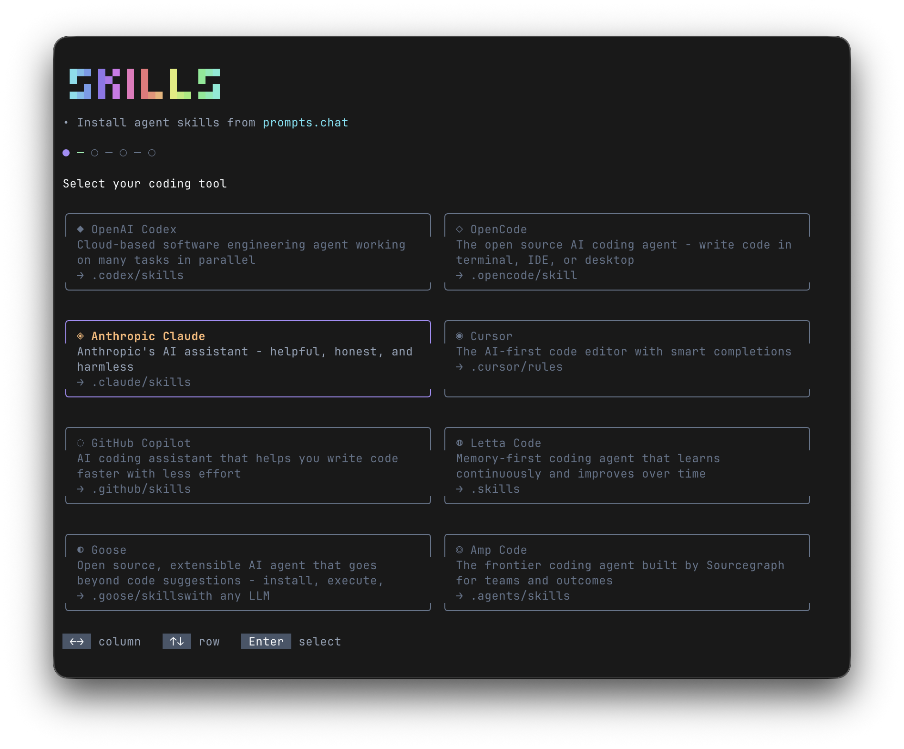

<p align="center">
  <h1 align="center">skills.chat</h1>
  <p align="center">
    <strong>Search and install Agent Skills from prompts.chat</strong>
  </p>
  <p align="center">
    A beautiful CLI tool to discover, favorite, and install AI agent skills into your local development environment.
  </p>
</p>

<p align="center">
  
</p>

<p align="center">
  <a href="https://www.npmjs.com/package/skills.chat"></a>
  <a href="https://github.com/beratcmn/skills.chat/blob/main/LICENSE"></a>
  <a href="https://www.typescriptlang.org/"></a>
</p>

---

## ✨ Features

- 🔍 **Search** — Find prompts from the prompts.chat registry
- ⭐ **Favorites** — Save skills for quick access without re-searching
- 📦 **Batch Install** — Select multiple skills and install them at once
- ✏️ **Custom Names** — Edit skill names before installation
- 🛠️ **Multi-Tool Support** — Works with all major AI coding assistants

## 🎯 Supported Tools

| Tool             | Install Path                      |
| ---------------- | --------------------------------- |
| OpenAI Codex     | `.codex/skills/<name>/SKILL.md`   |
| OpenCode         | `.opencode/skill/<name>/SKILL.md` |
| Anthropic Claude | `.claude/skills/<name>/SKILL.md`  |
| Cursor           | `.cursor/rules/<name>/SKILL.md`   |
| Amp Code         | `.agents/skills/<name>/SKILL.md`  |

## 🚀 Quick Start

```bash
# Run directly with npx (no install needed)
npx skills.chat

# Or with bunx
bunx skills.chat

# Or install globally
npm install -g skills.chat
skills.chat
```

### Development

```bash
# Clone and run locally
git clone https://github.com/beratcmn/skills.chat.git
cd skills.chat
bun install
bun run start
```

## ⌨️ Keyboard Controls

| Key     | Action                              |
| ------- | ----------------------------------- |
| `↑` `↓` | Navigate / scroll                   |
| `Space` | Select / deselect                   |
| `Enter` | Confirm / install                   |
| `f`     | Toggle favorite                     |
| `d`     | Remove favorite (in favorites view) |
| `Esc`   | Go back                             |

## 📁 How It Works

1. **Select your tool** — Choose which AI assistant you're using
2. **Search or browse favorites** — Find prompts or access saved ones
3. **Select skills** — Pick one or more skills to install
4. **Edit names** — Customize the skill names (kebab-case)
5. **Install** — Skills are saved to your current working directory


## 💾 Favorites

Favorites are stored globally at `~/.skills-chat/favorites.json`, so they persist across projects and sessions.

## 🤝 Contributing

Contributions are welcome! Feel free to:

1. Fork the repository
2. Create a feature branch (`git checkout -b feature/amazing-feature`)
3. Commit your changes (`git commit -m 'Add amazing feature'`)
4. Push to the branch (`git push origin feature/amazing-feature`)
5. Open a Pull Request

## 📝 License

This project is open source and available under the [MIT License](LICENSE).

---

<p align="center">
  Made with ❤️ for the AI coding community
</p>
